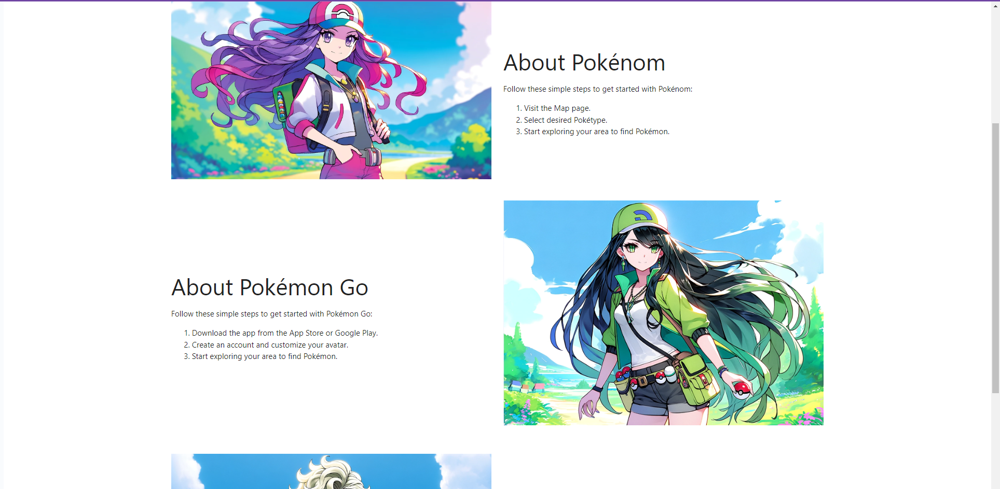
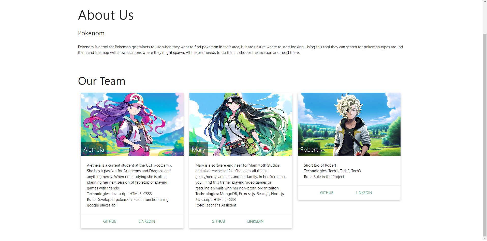
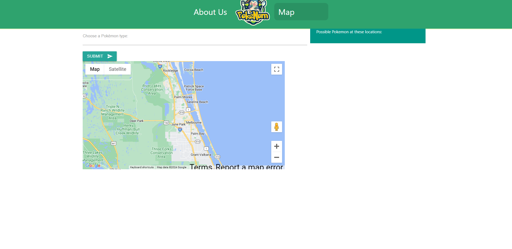
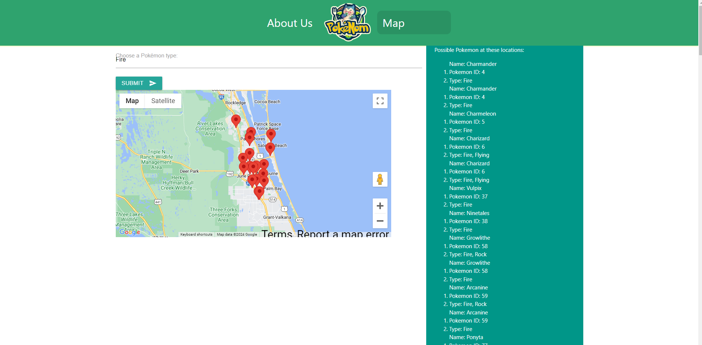

<!-- PROJECT LOGO -->

  
  

  

<h1> Pokenom </h1>    
    <a href="https://github.com/Aricoria10/pokenom"><strong>Explore the docs »</strong></a>
     
     
    <a href="https://aricoria10.github.io/pokenom/">View Site</a>
    ·
    <a href="https://github.com/Aricoria10/pokenom/issues">Report Bug</a>
    ·
    <a href="https://github.com/Aricoria10/pokenom/issues">Request Feature</a>
  

<!-- TABLE OF CONTENTS -->

  
Table of Contents

  <ol>
    <li>
      <a href="#about-the-project">About The Project</a>
      <ul>
        <li><a href="#built-with">Built With</a></li>
      </ul>
    </li>
    <li>
      <a href="#getting-started">Getting Started</a>
      <ul>
        <li><a href="#installation">Installation</a></li>
      </ul>
    </li>
    <li><a href="#roadmap">Roadmap</a></li>
    <li><a href="#contributing">Contributing</a></li>
    <li><a href="#license">License</a></li>
    <li><a href="#contact">Contact</a></li>
    <li><a href="#acknowledgments">Acknowledgments</a></li>
  </ol>

<!-- ABOUT THE PROJECT -->

## About The Project

Pokenom is a website where users who use Pokemon Go can search for pokemon types they are looking for and locations will appear in Google maps where the pokemon may appear as well as locations informations, such as possible restaurants.

### Built With

<!-- GETTING STARTED -->

## Getting Started

This app is fully functional at the following site:

[Github Pages](https://aricoria10.github.io/pokenom/)

### Installation

1. Clone the repo
   git clone https://github.com/Aricoria10/pokenom

<!-- USAGE EXAMPLES -->

<!-- ROADMAP -->

## Roadmap

- [x] Basic Styling
- [x] Pokemon Data
- [x] Places Data
- [x] Map
- [x] Filter Data
- [x] Final Styling
- [x] Fill out About Us page
- [x] Comments in Repo
- [x] README
- [x] Presentation Slidedeck
- [x] Deployment

See the [open issues](https://github.com/Aricoria10/pokenom/issues) for a full list of proposed features (and known issues).

<!-- CONTRIBUTING -->

## Contributing

Contributions are what make the open source community such an amazing place to learn, inspire, and create. Any contributions you make are **greatly appreciated**.

If you have a suggestion that would make this better, please fork the repo and create a pull request. You can also simply open an issue with the tag "enhancement".
Don't forget to give the project a star! Thanks again!

1. Fork the Project
2. Create your Feature Branch (git checkout -b feature/AmazingFeature)
3. Commit your Changes (git commit -m 'Add some AmazingFeature')
4. Push to the Branch (git push origin feature/AmazingFeature)
5. Open a Pull Request

<!-- LICENSE -->

## License

This project is licensed under the MIT license.

See LICENSE.txt for more information.

<!-- CONTACT -->

## Contact

<!-- Todo: Add your contact info if you want -->

[Robert McDermott](https://github.com/RobertMcDermot) - robojr181@yahoo.com

[Aletheia Bentley](https://github.com/Aricoria10/)

[Mary Elenius](https://www.maryelenius.com/d20) - mary.panda.jackson@gmail.com

Project Link: [https://github.com/Aricoria10/pokenom](https://github.com/Aricoria10/pokenom)

Deployed Link: [https://aricoria10.github.io/pokenom/](https://aricoria10.github.io/pokenom/)

## Acknowledgments

#### Aletheia

Thank you very much to Mary for all the help! Couldn't have done this without you!

#### Robert

Again thank you to mary.theia,and John for all the help in the past few weeks.

#### Mary

I would like to give a big shoutout to my partner in crime and daughter, Yennefer! Every day she proves she is small yet mighty!
